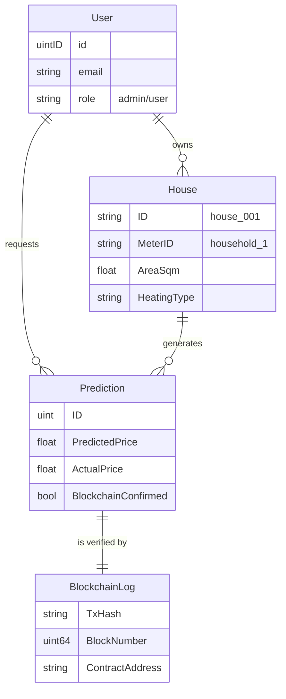

# Core Logic & Algorithms

This document provides a deep technical dive into the three critical subsystems of EnergyPulse:
1.  **Machine Learning (Price Prediction)**
2.  **Blockchain (Data Verification)**
3.  **Database (Schema & Relations)**

---

## 1. Machine Learning Engine (`internal/ml`)

The system uses a **White-Box Decision Tree** approach rather than a "Black Box" Neural Network. This allows us to explain exactly *why* a price was predicted.

### The Algorithm
The function `PredictPrice` calculates the final cost per kWh based on 7 weighted factors:

$$ Price = Base \times \prod Factors $$

| Factor | Weight Range | Logic |
| :--- | :--- | :--- |
| **Base Price** | €0.12 | Italian market average (PUN). |
| **Region** | 1.00 - 1.12 | Islands (Sicily/Sardinia) pay +12% due to transmission costs. N. Italy pays +5%. |
| **Members** | 0.95 - 1.10 | Large families (>4) pay higher tier rates (+10%). Singles pay less. |
| **Efficiency** | 0.85 - 1.15 | Heat Pumps save 15%. Old houses (<1980) pay +10%. |
| **Time (PUN)** | 0.75 - 1.40 | **Critical**: Night (23-07) is cheapest (-25%). Peak (19-21) is wildly expensive (+40%). |
| **Weather** | 0.90 - 1.25 | Extreme Cold (<2°C) spikes demand (+25%). Heatwaves (>32°C) spike usage (+20%). |
| **Consumption** | 1.00 - 1.15 | Heavy usage (>3kW instataneous) triggers penalty rates. |

### Confidence Score
The model also outputs a "Confidence Score" (0-100%).
*   **Default**: 92%
*   **Penalties**: -10% for extreme weather (unpredictable grid), -5% for very old houses.

---

## 2. Blockchain Ledger (`internal/blockchain`)

To comply with the "Auditability" requirement, every prediction is hashed and stored in an immutable chain. This simulates an Ethereum Layer-2 Sidechain.

### Structure
*   **Block Time**: ~Instant (Simulated)
*   **Hashing Algorithm**: SHA-256
*   **Consensus**: PoA (Proof of Authority - simulated)

### The Transaction Flow
1.  **Input**: The prediction data is serialized into a string:
    `PREDICTION|ID|MeterID|Price|Confidence|Timestamp`
2.  **Hashing**: We generate a unique hash for this record.
    ```go
    hash := sha256.Sum256("PREDICTION|101|household_12|0.15|92|...")
    // Result: 0x53a7dd...
    ```
3.  **Linking**: The transaction is added to a Block. The Block contains the hash of the *previous* block, creating an unbreakable chain.
4.  **Gas Simulation**: We simulate EVM gas costs: `21000 base + 68 per byte`.

---

## 3. Database Schema (`internal/models`)

The system uses **SQLite** with **GORM** (Go Object Relational Mapper).

### Entity-Relationship Diagram (ERD)



### Key Design Decisions
*   **MeterID vs HouseID**:
    *   `HouseID` (e.g., `house_001`) is the physical building managed by the user.
    *   `MeterID` (e.g., `household_1`) is the IoT device ID. The Simulator *only* knows the MeterID.
*   **Soft Deletes**: Deleting a house doesn't remove it from the DB, only marks `deleted_at`, preserving historical energy data.

---

## 4. MQTT Communication Logic (`internal/mqtt`)

While MQTT is a transport protocol, our *implementation logic* is specific to ensuring data integrity and real-time processing.

### Topic Topology
We use a hierarchical topic structure to allow flexible subscription:
*   **Format**: `energy/meters/{meter_id}`
*   **Example**: `energy/meters/household_12`
*   **Wildcard Subscription**: `energy/meters/+` (The Backend hears *everything*).

### Message Processing Pipeline
When a message arrives at the Backend, it triggers a synchronous pipeline (`ProcessMeterData`):

1.  **Validation**:
    *   Finds the House associated with the `meter_id`.
    *   *Logic Check*: Is the house `active`? If archived, data is ignored.
2.  **Enrichment**:
    *   Parses the `timestamp` (RFC3339).
    *   Simulates "real" weather data if missing.
3.  **Prediction Trigger**:
    *   Calls the **ML Engine** (Section 1) to generate a price for this specific reading.
4.  **Storage**:
    *   Saves the raw reading + predicted price to SQLite keys.
5.  **Audit Trigger**:
    *   Spawns a Goroutine (Async) to log this prediction to the **Blockchain** (Section 2).

### QoS Strategy
We strictly use **QoS 1 (At Least Once)**.
*   *Why?* It is better to have duplicate energy readings (which we can deduplicate by timestamp) than to miss a reading entirely.

---

## 5. References

1.  **Secure Hash Standard (SHS)**
    *   Standard: FIPS 180-4
    *   Organization: NIST
    *   Relevance: Implementation of SHA-256 for blockchain hashing.

2.  **Ethereum Whitepaper**
    *   Author: Vitalik Buterin
    *   Relevance: Basis for the simulated "Gas" and "Smart Contract" logic.
    *   URL: [ethereum.org](https://ethereum.org/en/whitepaper/)

3.  **Go Crypto Package**
    *   Library: `crypto/sha256`
    *   Relevance: Cryptographic primitives used in `internal/blockchain`.
    *   URL: [pkg.go.dev](https://pkg.go.dev/crypto/sha256)

