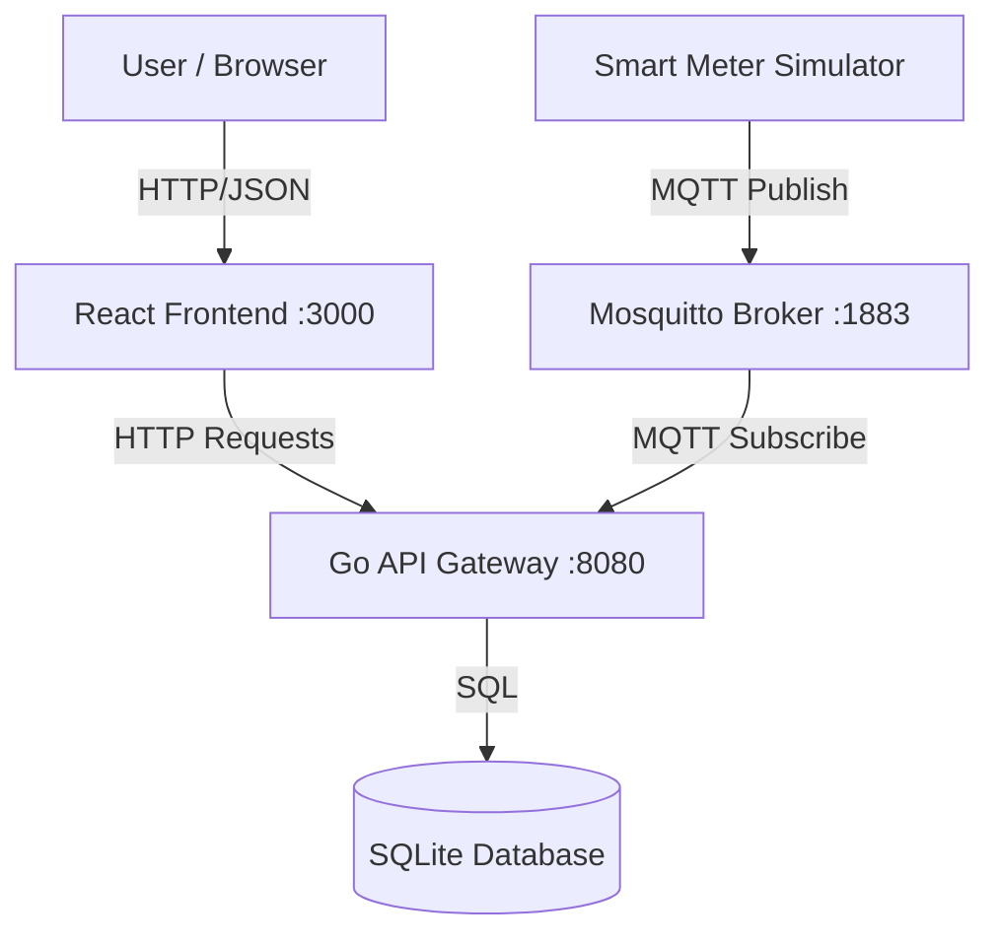

# System Data Flow & Architecture Explained

This document explains exactly how the different parts of **EnergyPulse** talk to each other.

---

## 1. High-Level Architecture

The system uses a **Hybrid Architecture** combining two patterns:
1.  **REST API (Request-Response)**: For user actions (Login, viewing dashboards).
2.  **Event-Driven (Pub-Sub)**: For high-speed IoT data (Smart Meters).

---

## 2. The "Web" Flow (Frontend <-> Backend)
*Used for: Authentication, User Profiles, Fetching Historical Data.*

This follows the standard web application pattern.

### **Example: User Login**
1.  **Frontend**: User types email/password. React calls `axios.post('http://localhost:8080/auth/login', {email, password})`.
2.  **Backend**:
    *   Receives request at `/auth/login`.
    *   Checks `users` table in SQLite.
    *   If valid, generates a **JWT Token**.
3.  **Frontend**: Receives the token and saves it (e.g., in `localStorage`).
4.  **Next Requests**: Every subsequent request (e.g., "Get My House") verifies identity by sending this token in the header: `Authorization: Bearer <token>`.

---

## 3. The "IoT" Flow (Simulator -> Backend)
*Used for: Real-time Energy Readings.*

This bypasses the frontend entirely. It is **asynchronous**.

### **Step-by-Step Data Journey**
1.  **Generation**: The `simulator` container creates a fake reading (e.g., `0.45 kWh`) for `household_12`.
2.  **Publishing**: The simulator "publishes" this message to the MQTT topic: `energy/meters/household_12`.
    *   *Note: The simulator doesn't know who is listening. It just broadcasts.*
3.  **Brokering**: The `mosquitto` container receives the message. It checks its list of subscribers.
4.  **Consumption**: The `api-gateway` (Backend) is subscribed to `energy/meters/+` (all meters). It receives the message instantly.
5.  **Processing (The "Business Logic")**:
    *   **Store**: The backend saves the raw reading to the `predictions` table in SQLite.
    *   **Calculate**: It runs the pricing algorithm based on the current hour and simulated temperature.
    *   **Audit**: It generates a SHA-256 hash of the data and logs it to the `blockchain_logs` table.

---

## 4. How the User Sees the Data (The Loop)
How does the data from the Simulator appear on the User's screen?

1.  **Simulator** sends data -> **Backend** saves it to DB.
    *   *(This happens constantly in the background)*
2.  **Frontend** (React) has a `useEffect` hook that runs every 3-5 seconds (Polling).
3.  **Frontend** asks: `GET /api/houses/my-house/forecast`.
4.  **Backend** queries the DB for the latest 24 hours of data.
5.  **Frontend** updates the charts on the screen.

### Why not WebSockets?
For this project, we use **Polling** (asking every few seconds). In a commercial V2.0, we would use **WebSockets** to push the data instantly to the browser without the frontend having to ask.

---

## 5. File Mapping (Where is the code?)

| Component | Logic Location | Description |
| :--- | :--- | :--- |
| **Login Logic** | `internal/handlers/auth.go` | Handles password checks & JWT generation. |
| **API Routes** | `cmd/api-gateway/main.go` | Defines all URL endpoints (e.g., `/api/houses`). |
| **MQTT Receiver** | `internal/mqtt/subscriber.go` | The function `messagePubHandler` processes incoming IoT messages. |
| **Frontend API** | `static/services/*.ts` | TypeScript files that define how to call the Backend. |
